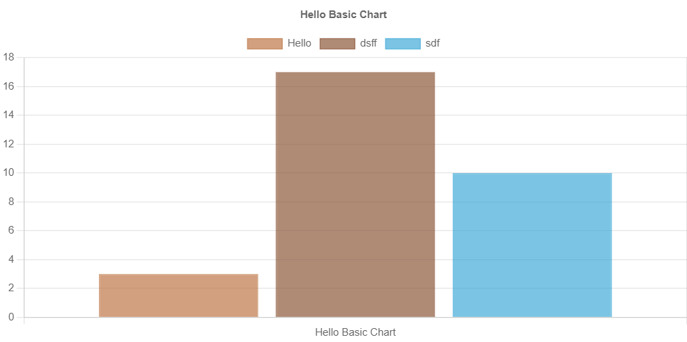
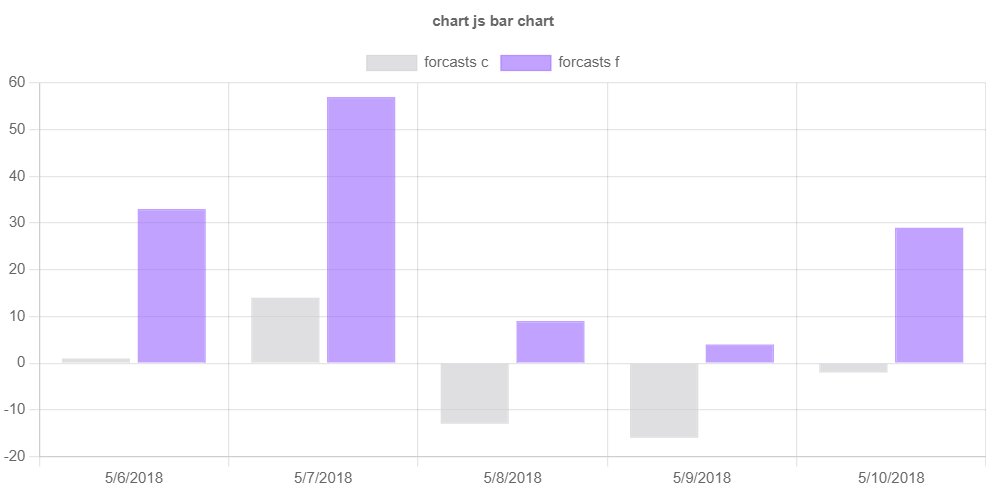

# ChartJS.Blazor WASM
a razor library to integrate chart.js library to Blazor 


## install
```{ps}
dotnet add package BlazorChartJS --version 1.0.3
```

## Setups
- In the `index.html` add the following scripts to add the `chart.js` 
```{html}
<script src="https://cdn.jsdelivr.net/npm/chart.js"></script>
```

- Add the `ChartJSInterop` as transient 

```{c#}
builder.Services.AddTransient<ChartJSInterop>();
```

## Implement

- To Load new data in chart, it must invoke `InitChartAsync`
- I am so busy right now so you can add any chartJs using the very basic configurations

### Basic Bar Chart Component

```{razor}
<button @onclick="ReloadBasicChart">Reload Basic Chart</button>

<BasicBarChart @ref="_chart"  Title="Hello Basic Chart" Data="@(new() { ["Hello"] = (double)new Random().Next(1,20) , ["dsff"] = (double)new Random().Next(1,20), ["sdf"] = (double)new Random().Next(1,20)})"></BasicBarChart>

@code{
    private BasicBarChart _chart;

    private async Task ReloadBasicChart()
    {
        await _chart.InitChartAsync();
    }
}
```

### Advanced Bar Chart Component

```{razor}
<ChartCanvas Configs="_config"></ChartCanvas>


@code{
    private BasicBarChart _chart;

_config = new ChartConfig
        {
            Type = ChartJSTypes.Bar,
            Data = new ChartData
            {
                Datasets = new List<ChartDataset>
             {
                     new ChartDataset
                     {
                         BackgroundColor = new List<string>{ChartJSColors.Transparent60.Grey },
                         BorderColor =new List<string>{ChartJSColors.Transparent60.Grey },
                         Data = forecasts.Select(x=> (double)x.TemperatureC).ToList(),
                         BorderWidth =1,
                         Label ="forcasts c"

                     },
                     new ChartDataset
                     {
                         BackgroundColor = new List<string>{ChartJSColors.Transparent60.Violet },
                         BorderColor =new List<string>{ChartJSColors.Transparent60.Violet},
                         Data = forecasts.Select(x=> (double)x.TemperatureF).ToList(),
                         BorderWidth =1,
                         Label ="forcasts f"

                     }
                 },
                Labels = forecasts.Select(x => x.Date.ToShortDateString()).ToList()
            },
            Options = new ChartOptions
            {
                Responsive = true,
                Plugins = new ChartPlugin
                {
                    Legend = new ChartLegend
                    {
                        Position = ChartJsPositions.Top
                    },
                    Title = new ChartTitle
                    {
                        Display = true,
                        Text = "chart js bar chart"
                    }
                }
            }

        };
}
```
